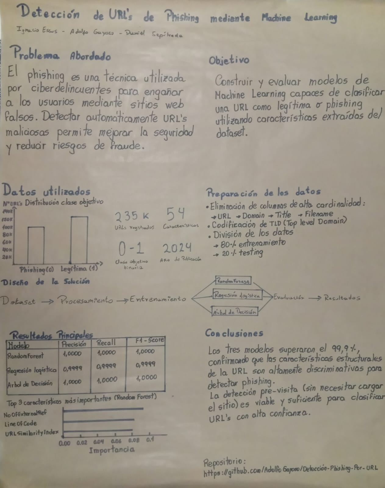

# Detección de Phishing por URL

Este proyecto implementa y compara modelos de Machine Learning para clasificar URLs como sospechosas de phishing o legítimas, permitiendo automatizar la detección de amenazas cibernéticas.

El proyecto fue desarrollado y ejecutado en **Google Colab** 

## Integrantes
* Ignacio Essus
* Adolfo Gayoso
* Daniel Sepulveda

## Problema
El phishing es uno de los ataques de ingeniería social más comunes y dañinos en la actualidad. Consiste en engañar a los usuarios para que revelen información confidencial (como credenciales de acceso o datos bancarios) a través de sitios web fraudulentos que imitan a los legítimos. 

El principal desafío radica en identificar de manera automática y precisa si una URL dada corresponde a un sitio de phishing o legítimo. Para resolver esto, se utilizó el [PhiUSIIL Phishing URL Dataset](https://archive.ics.uci.edu/dataset/967/phiusiil+phishing+url+dataset). Este conjunto de datos cuenta originalmente con **235,795 instancias** y **54 características**, divididas de la siguiente manera:
- **Clase 1 (Phishing):** 134,850 muestras
- **Clase 0 (Legítimo):** 100,945 muestras

Siendo esto un problema de **Clasificación Binaria Supervisado**.

## Solución
La solución se estructuró a través de un flujo completo de analisis de datos entrenando tres modelos distintos de Machine Learning:
* **Random Forest Classifier**
* **Regresión Logística**
* **Decision Tree Classifier**
## Papelografo

